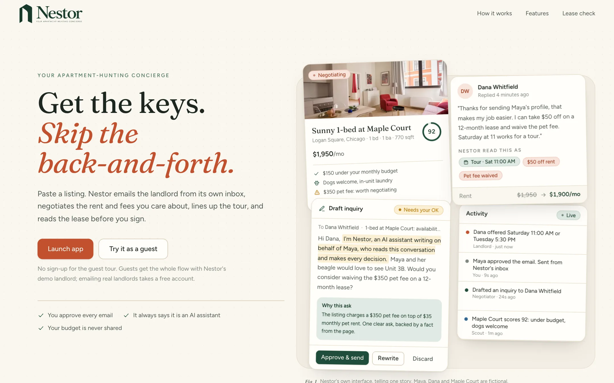
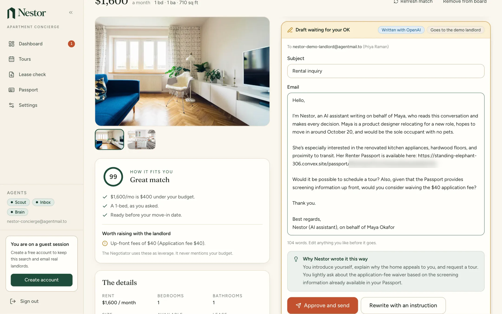
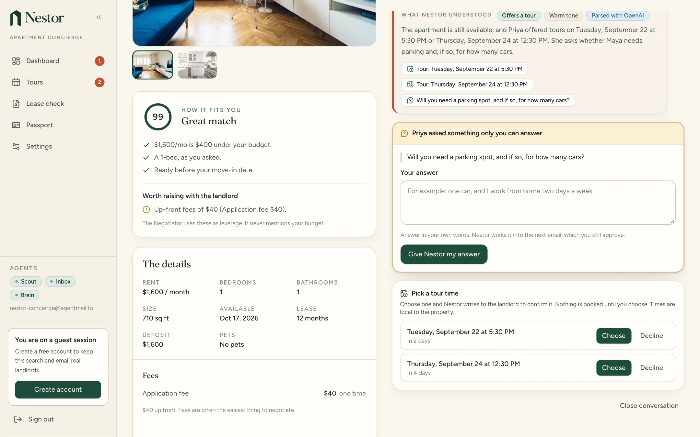
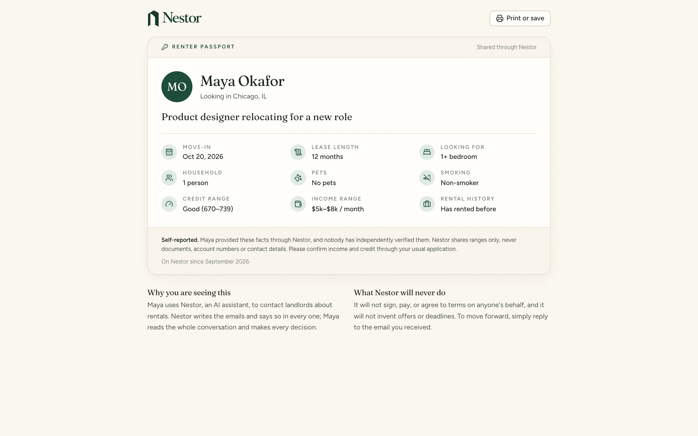
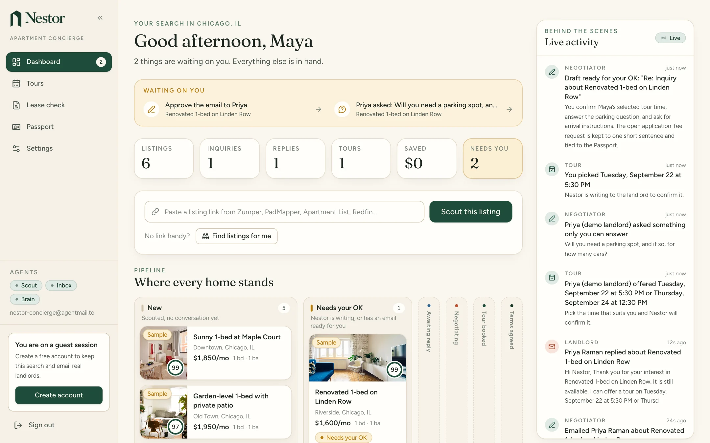
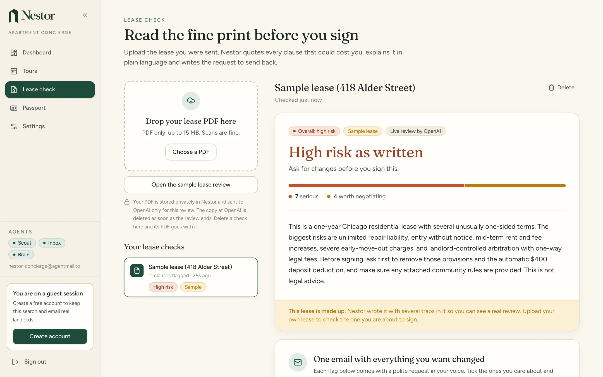
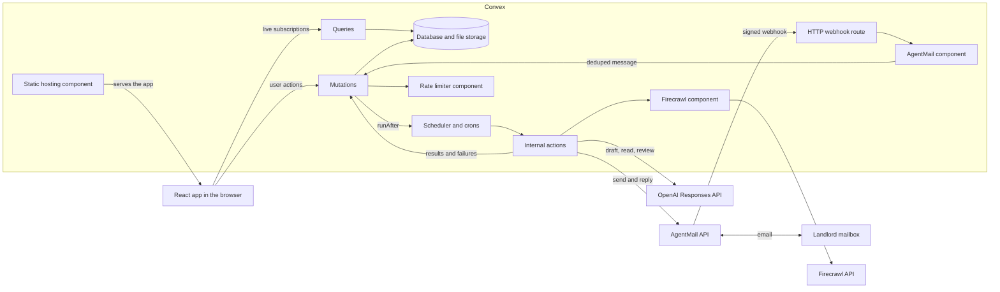

# Nestor

Nestor is an apartment-hunting assistant that reads rental listings, emails landlords from its own inbox, negotiates the terms you care about, books tours, and checks the lease before you sign.

**[Live app](https://standing-elephant-306.convex.site)** · [Build log](hackathon.md) · [Product spec](NESTOR_PROJECT_SPEC.md)

Built for the [Convex All Gas Hackathon](https://www.convex.dev/hackathons/all-gas) on Convex, Firecrawl, AgentMail and OpenAI.



## Try it in two minutes

No sign-up is needed. Everything below runs on the live URL as a guest.

1. Open https://standing-elephant-306.convex.site, choose **Launch app**, then **Continue as guest**. One click, no form.
2. Fill in the 3-step onboarding: where you are looking and your budget, your Renter Passport facts, and what you want negotiated (lower rent, a waived fee, a flexible move-in date). It is three short forms.
3. On the dashboard choose **Load sample listings**. Six listings, shaped around your city and budget, appear one at a time and are scored against your profile. About 7 seconds.
4. Open a listing and choose **Try it with the demo landlord**. The Negotiator writes a draft and shows its reasoning. About 8 seconds.
5. Choose **Approve and send**. The email leaves the agent inbox over AgentMail, the demo landlord answers from its own inbox, and the reply comes back through the signed webhook. About 15 seconds. Nestor reads the reply into tour times, offers and open questions. Pick a tour time and watch the card move across the board.
6. Go to **Lease check** and choose **Try the sample lease**. OpenAI reviews a fictional lease and quotes the clauses worth a second look. About 36 seconds.
7. Optional: in **Settings**, turn the guest session into an email and password account. Listings, conversations and lease checks stay attached.

Guests talk to a demo landlord. It is labelled as one everywhere, but the mail is real: two AgentMail inboxes exchange actual email, and the reply is parsed by the same code that reads a real landlord's answer. Emailing a real landlord needs a free account, because the site is public and a guest session costs one click to create.

You can also paste a real listing URL (the Scout targets Zumper, PadMapper, Apartment List and Redfin; a PadMapper listing was the one scraped and scored in development) or choose **Find listings for me**. Both call Firecrawl.

### What was checked on the live site

Observed on 2026-09-20: the full walk-through above passed in a browser with zero browser errors, including the guest upgrade, sign-out and sign-in with all data intact. The demo landlord's reply was read into two tour times. The sample lease check flagged 11 clauses (7 serious, 4 worth negotiating) and carried the not-legal-advice note. An unsigned POST to `/agentmail/webhook` returns 401. In development, a real PadMapper listing was scraped and scored in about 5 seconds, and Firecrawl search discovered and queued a listing.

## The problem

Finding an apartment is a second job. You read dozens of listings that bury the fees, write the same introduction to every landlord, chase replies across an inbox, and then sign a long contract you did not have time to read. Asking for a lower rent or a waived fee takes effort and feels awkward, so it is easy to skip.

## What Nestor does

### Scout

Paste a listing URL, or ask Nestor to find listings. Firecrawl extracts rent, fees, deposit, pet policy, availability and amenities, and a rule-based scorer rates the home from 0 to 100 against your profile with up to six reasons and six concerns. If the listing prints no contact address, the Scout searches the property's own website for a published one and shows where it found it. It never guesses an address.

### Negotiator

Nestor drafts an inquiry from its own inbox, links your Renter Passport, and asks for at most two things you chose. You approve every email unless you turn on autopilot. Replies are read into tour slots, offers, concessions and questions.





### Renter Passport

A public page a landlord can open from the email: who you are, when you want to move, and your credit and income as bands. No documents, no contact details, no budget. The link is an unguessable token and can be replaced at any time.



### Live dashboard

Listings move across a six-column pipeline (New, Needs your OK, Awaiting reply, Negotiating, Tour booked, Terms agreed) next to a feed of what the agents are doing. The dashboard page itself makes seven Convex subscriptions and does no polling, so nothing needs a refresh.



### Lease check

Upload the lease PDF. Nestor quotes the clauses that deserve a second look, explains each in plain language, rates it, and suggests what to ask for in your own voice. It is not legal advice and says so on every result.



## How the sponsors do real work

| Sponsor | What it does in Nestor | Where |
| --- | --- | --- |
| Convex | The whole backend and the hosting: database, auth, scheduling, crons, file storage, HTTP endpoints, four components, and the static site itself | [convex/schema.ts](convex/schema.ts), [convex/convex.config.ts](convex/convex.config.ts), [convex/http.ts](convex/http.ts), [convex/crons.ts](convex/crons.ts) |
| Firecrawl | Scrapes listing pages into structured facts, searches the web for listings, and finds a leasing office's published email | [convex/scout.ts](convex/scout.ts), [convex/lib/listingSchema.ts](convex/lib/listingSchema.ts) |
| AgentMail | Sends every email, threads replies, and delivers landlord answers by signed webhook | [convex/mail.ts](convex/mail.ts), [convex/agentmailApi.ts](convex/agentmailApi.ts), [convex/landlordSim.ts](convex/landlordSim.ts) |
| OpenAI | Writes the emails, reads the replies, and reviews the lease PDF, all with structured output | [convex/negotiator.ts](convex/negotiator.ts), [convex/leaseAuditor.ts](convex/leaseAuditor.ts), [convex/lib/openai.ts](convex/lib/openai.ts), [convex/lib/aiSchemas.ts](convex/lib/aiSchemas.ts) |

### Firecrawl

The Firecrawl Convex component (`@firecrawl/firecrawl-convex` 0.1.1) is mounted in [convex/convex.config.ts](convex/convex.config.ts) with the key passed as typed component env. It is used three ways, all in [convex/scout.ts](convex/scout.ts):

1. **Scrape with a JSON schema.** Each listing is scraped with `markdown`, `images` and a `json` format carrying a 19-property schema and a prompt, `onlyMainContent` on, a 90 second timeout, `proxy: "auto"`, `blockAds`, and a one hour `maxAge` (zero on a scheduled refresh, so a price change is not hidden by cache).
2. **Search for discovery.** One query is built from the renter's profile. Results are filtered to listing detail pages on Zumper, PadMapper, Apartment List, Redfin, Realtor.com and Trulia, and links are harvested from at most two portal index pages with a cheap `links` scrape. At most four listings are queued per search, six seconds apart.
3. **Search plus scrape for contact lookup.** The Scout searches for the building's leasing office, drops results on 35 portal and social domains, scrapes at most three pages, and returns at most five candidates ranked by mailbox role and by whether the address is on the property's own domain. A page is used only if it mentions the property by name or by street number and street name.

The extracted JSON is treated as untrusted model output. [normalizeListing](convex/lib/listingSchema.ts) bounds every field, drops "fees" that are really floor-plan rents, filters logos and map tiles out of photos, and the result is validated again by a Convex validator on the mutation that stores it. Firecrawl errors (401, 402, 403, 429, timeouts, 5xx) become plain sentences for the renter. Craigslist and Facebook links are refused at paste time with a suggestion of sites that work.

### AgentMail

Nestor has two inboxes for the whole deployment: the agent inbox and the demo landlord inbox. Every renter shares the agent inbox, and conversations are told apart by AgentMail thread id.

- **Outbound** goes over AgentMail's REST API with `fetch` ([convex/agentmailApi.ts](convex/agentmailApi.ts)). The first email uses `messages/send`. Once the landlord has written back, every email uses `messages/{id}/reply` against the newest inbound message that did not come from a no-reply, mailer-daemon or postmaster address, so it joins the landlord's thread and is not threaded under a bounce from those senders. The reply recipient is pinned to the approved address.
- **Idempotency.** Every send carries an `Idempotency-Key` built from the message id and a hash of the subject and body. A retry reuses the key. An edited draft gets a new one.
- **Inbound** uses the `@agentmail/convex` component (0.1.0). `POST /agentmail/webhook` verifies the Svix signature (503 with no secret configured, 401 on a bad signature, 204 otherwise) and hands the event to the component, which dedupes by event id, stores the message, and runs Nestor's handler as a mutation on its own callback workpool, so a handler failure cannot block webhook ingest.
- **Routing.** A message finds its conversation by AgentMail thread id, then by `In-Reply-To` and `References`. Mail matching no conversation is logged and ignored. The app also dedupes by AgentMail message id, because the webhook and the poller give the same email different event ids.
- **No public URL?** A 20 second cron polls the inbox instead when `AGENTMAIL_POLL=1`, and feeds the same component ingest with a deterministic event id.

### OpenAI

Four calls, all through the Responses API with `responses.parse`, a zod schema sent as a strict JSON schema, and `store: false`:

| Call | File | Model id in code | Notes |
| --- | --- | --- | --- |
| Write the email | [convex/negotiator.ts](convex/negotiator.ts) | `gpt-5.6-terra` | Reasoning effort low. The output is checked against the policy before it is shown. |
| Read a landlord reply | [convex/negotiator.ts](convex/negotiator.ts) | `gpt-5.6-luna` | Tour times, rents and lists are bounded in code after parsing. |
| Reword the demo landlord | [convex/landlordSim.ts](convex/landlordSim.ts) | `gpt-5.6-luna` | Times, prices and questions are copied exactly from a script. |
| Review the lease | [convex/leaseAuditor.ts](convex/leaseAuditor.ts) | `gpt-5.6-sol` | Uploaded lease: effort high, up to 32,000 output tokens. Sample lease: sent as text, effort medium, 16,000. |

Each role has one fallback model, tried once and only when the primary is unavailable for the key. The model that answered a lease review is stored on the audit row.

An uploaded lease PDF goes to OpenAI through the Files API (purpose `user_data`) and is reviewed as an `input_file`, never as base64, because a Convex action has 64 MiB of memory. The file is uploaded with a one hour expiry and deleted in a `finally` block whatever happens.

Every AI path has a labelled fallback. Without a key, or when a call fails or a draft breaks a rule, the Negotiator sends a template built only from stored facts and says so in the rationale. Reply reading falls back to pattern matching. The sample lease falls back to a pre-written review whose summary says no model wrote it.

## Convex depth

| Feature | Where it is used | File |
| --- | --- | --- |
| Schema and indexes | 8 application tables plus the Convex Auth tables, 19 indexes, one for every lookup | [convex/schema.ts](convex/schema.ts), [convex/lib/validators.ts](convex/lib/validators.ts) |
| Queries | Pipeline board, dashboard summary (6 bounded indexed reads in parallel), activity feed, conversation, tours, integration status | [convex/listings.ts](convex/listings.ts), [convex/dashboard.ts](convex/dashboard.ts), [convex/activity.ts](convex/activity.ts), [convex/system.ts](convex/system.ts) |
| Mutations | Every stage transition of a conversation, approvals, tour choice, profile save, all with args and returns validators | [convex/threads.ts](convex/threads.ts), [convex/tours.ts](convex/tours.ts), [convex/renters.ts](convex/renters.ts) |
| Actions | Anything that talks to Firecrawl, AgentMail or OpenAI, all internal | [convex/scout.ts](convex/scout.ts), [convex/mail.ts](convex/mail.ts), [convex/negotiator.ts](convex/negotiator.ts), [convex/leaseAuditor.ts](convex/leaseAuditor.ts) |
| Scheduled functions | Starting work, spacing scrapes 6 seconds apart, re-scoring listings after a profile change, and watchdogs for drafts, deliveries, scrapes, contact searches and lease reviews | [convex/listings.ts](convex/listings.ts), [convex/threads.ts](convex/threads.ts), [convex/leaseAudits.ts](convex/leaseAudits.ts) |
| Crons | Inbox poll every 20 seconds (a no-op unless polling is on), listing re-check every 12 hours, orphan upload sweep every hour | [convex/crons.ts](convex/crons.ts) |
| File storage | Lease PDFs: upload URL, blob vetted through `ctx.db.system.get`, read in the action, orphans swept from the `_storage` system table | [convex/leaseAudits.ts](convex/leaseAudits.ts), [src/components/lease/UploadZone.tsx](src/components/lease/UploadZone.tsx) |
| HTTP actions | Convex Auth discovery routes, the signed AgentMail webhook, and the SPA as a GET catch-all | [convex/http.ts](convex/http.ts) |
| Convex Auth | Anonymous (one-click guest) and Password providers, with a guest upgraded in place | [convex/auth.ts](convex/auth.ts), [convex/lib/auth.ts](convex/lib/auth.ts) |
| Component: Firecrawl | Scrape and search | [convex/scout.ts](convex/scout.ts) |
| Component: AgentMail | Signature check, dedupe and storage of inbound mail | [convex/mail.ts](convex/mail.ts) |
| Component: rate limiter | 22 named limits, per renter and deployment-wide: 19 in limits.ts, the sample lease caps in leaseAudits.ts and the Passport view notice in renters.ts | [convex/lib/limits.ts](convex/lib/limits.ts), [convex/leaseAudits.ts](convex/leaseAudits.ts), [convex/renters.ts](convex/renters.ts) |
| Component: static hosting | Serves the built React app from `<deployment>.convex.site` | [convex/convex.config.ts](convex/convex.config.ts), [vite.config.ts](vite.config.ts) |
| Typed environment | Keys declared in `defineApp({ env })` and read through the typed `env` export | [convex/convex.config.ts](convex/convex.config.ts), [convex/lib/integrations.ts](convex/lib/integrations.ts) |
| Realtime queries | 32 `useQuery` call sites and no REST data layer. Dashboard.tsx alone makes 7 | [src/pages/Dashboard.tsx](src/pages/Dashboard.tsx), [src/components/AppShell.tsx](src/components/AppShell.tsx) |

### The core loop

Every slow step has the same shape. A public mutation checks ownership and rate limits, writes a row with a status such as `queued`, and schedules an internal action with `ctx.scheduler.runAfter(0, ...)`. The action calls the outside service and reports back through an internal mutation that writes the result or the failure onto the same row. The browser never waits on an action: it is subscribed to the row and redraws when the row changes.

Convex does not retry actions, so every action that holds a row in a working state has a watchdog mutation (3 minutes for a draft or a delivery, 8 for a scrape, 4 for a contact search, 11 for a lease review). Discovery and reply reading hold no row in a working state and have none. If the action died, the watchdog settles the row with an explanation. If the work finished, it does nothing.

Pasting a URL is the simplest example: [listings.addByUrl](convex/listings.ts) normalizes and dedupes the URL, spends a rate-limit token, inserts the row and schedules [scout.scrapeListing](convex/scout.ts), which ends in `applyScrape` or `failScrape`.

## Architecture



### Conversation stages

A thread is one email conversation with one landlord. All transitions happen in mutations in [convex/threads.ts](convex/threads.ts), [convex/mail.ts](convex/mail.ts) and [convex/tours.ts](convex/tours.ts).

| Stage | Meaning |
| --- | --- |
| `drafting` | The Negotiator is writing the next email |
| `needs_approval` | A draft is waiting for the renter |
| `awaiting_reply` | An email was sent and nothing has come back |
| `negotiating` | The landlord answered, and the reply is being read or answered |
| `tour_scheduled` | The renter picked a time and the confirmation email went out. A landlord's confirmation is logged in the feed but is not required for this stage |
| `terms_agreed` | The landlord accepted. Nothing is signed, and the next step is the renter's |
| `declined` | The landlord said no. Terminal |
| `closed` | The renter closed or archived it. Terminal |

Later mail on a terminal thread is recorded but never re-opens it.

## Honest by design

Nestor writes to strangers on someone's behalf, so the rules are enforced in code, with the prompt as a second layer. Most of it lives in [convex/lib/negotiationPolicy.ts](convex/lib/negotiationPolicy.ts).

| Rule | How it is enforced |
| --- | --- |
| Every email says an AI wrote it | `ensureDisclosure` checks the opening of every email for the disclosure and inserts one if missing. It runs on model drafts, on templates, and again on the renter's own edits at approval. Every draft Nestor writes is signed "Nestor (AI assistant), on behalf of" the renter. A renter's edit can remove the signature but not the disclosure |
| The budget is never shared | The budget is never placed in a prompt. The only personal facts given to the model come from `shareableFacts`, which omits budget, neighborhoods and goals. A lower-rent ask targets 5% under the asking rent, derived from the listing alone. A draft that states the budget is discarded |
| At most two asks per email | `chooseAsks` picks them in code from the renter's goals, skips any with no real fact behind it or that the landlord already granted, and the model sees only that list |
| No commitments | A pattern check rejects any draft that mentions an SSN, bank or card details, or promises to sign, pay, wire or send a deposit. A model draft that trips it is replaced by the template. A renter's edit to a real landlord is refused with the reason |
| Offers are recorded, never accepted | Reading a reply is reversible bookkeeping. A tour stays `proposed` until the renter picks it. A rent figure under 60% of asking is treated as a misread |
| Never guess an email address | An address is kept only if it literally appears in the page text or a `mailto` link. The Scout writes candidates, never the contact itself: the renter picks one, and picking an address outside the stored candidates is rejected. Every address carries its source: `listing`, `scout_search`, `renter` or `sample` |
| The renter approves by default | Autopilot is off on a new profile. At most 8 emails are sent per conversation, checked before drafting, at approval, at delivery and before a follow-up |
| Auto-replies are not answered | Bounces and out-of-office mail are detected by sender and subject, shown to the renter, never sent to a model and never answered. A thread gets at most 12 paid readings a day, so autopilot cannot sustain a mail loop |
| Web pages and landlord emails are untrusted | Their text is wrapped in delimiters before it reaches a model, and any delimiter tag inside the text is replaced so it cannot close the wrapper early. Landlord email bodies render as plain text in the UI |

Two limits to be plain about: the rule against inventing competing offers or urgency is prompt-only, and the commitment check is a pattern match, so it catches the phrasings it lists.

### Abuse controls

The live site is public and a guest session is one click, so everything that spends credits or sends mail is capped with the rate limiter component ([convex/lib/limits.ts](convex/lib/limits.ts)).

| Action | Per renter | Whole deployment |
| --- | --- | --- |
| Listing scrapes | 12 per hour, burst 6 | 150 per day |
| Discovery searches | 4 per hour | 30 per day |
| Contact lookups | 8 per hour | 40 per day |
| Drafts | 40 per hour, burst 10 | 300 per day |
| Email to real landlords | 6 per day | 35 per day |
| Email to the demo landlord | 12 per day | 50 per day |
| Lease checks | 5 per day | 25 per day |
| Sample lease check | 3 per day | 60 per day (then the pre-written review) |
| Upload URLs | 10 per day | 150 per day |

Also: at most 3 emails a day to any one recipient address, counted across all renters. Guests cannot email outside addresses at all: a real conversation is refused unless the listing has a contact email, the renter has an account, and inbound mail can get back in. When a demo conversation is over quota it never blocks. It is delivered inside Convex instead, and the message is labelled as such.

Authorization never takes a user or renter id from the client. Identity comes from the session, and [requireOwned](convex/lib/auth.ts) loads a document and checks its owner, answering "Not found." otherwise.

### Passport privacy

The public query [renters.passport](convex/renters.ts) returns exactly 15 allow-listed fields. The `returns` validator is the allow-list and the handler builds the object field by field, so a new column cannot leak. Budget, neighborhoods, must-haves, negotiation goals and ids are never returned, and the renters table holds no email address. Credit and income are stored as bands, never numbers. The token is 16 random bytes (128 bits), and replacing it kills the old link at once. Views are counted, never who viewed, at most 30 per minute per token. The page sets `noindex, nofollow` and states that its facts are self-reported.

## Engineering notes

**AgentMail is used two ways on purpose.** In `@agentmail/convex` 0.1.0 the component's HTTP helper reads `AGENTMAIL_API_KEY` from `process.env` inside the component, and the component declares no env that an app could bind. The package README says to set the key on the deployment. With Convex's typed component env, Nestor's reading is that an undeclared variable does not reach the component, so its send and inbox functions would fail with a missing-key error. This was not run to confirm it. Inbound needs no key. So inbound uses the component (signature check helper, dedupe by event id, storage, callback workpool) and outbound uses the REST API directly.

**The Firecrawl JSON schema is written by hand.** The schema crosses a Convex function boundary into the component, and Convex rejects object keys that start with `$`. A generated schema with `$schema`, `$ref` or `$defs` cannot be passed, so [LISTING_JSON_SCHEMA](convex/lib/listingSchema.ts) is plain JSON Schema with nullable types. For the same reason the Scout has a direct-API fallback: when the component call fails for a reason other than a Firecrawl error (page metadata with keys Convex refuses), the same request goes straight to the Firecrawl scrape endpoint.

**No file uses `"use node"`.** The OpenAI SDK, the AgentMail REST calls and the webhook verification all run in Convex's default runtime with `fetch`. That avoids a second runtime and its cold starts, and it is why the lease PDF goes through the OpenAI Files API instead of being held in memory as base64.

**Static hosting is mounted at the root.** The component is registered with no `httpPrefix`, as a GET catch-all after the app's own routes in [convex/http.ts](convex/http.ts). Exact routes win, so Convex Auth discovery under `/.well-known/` and the webhook keep their fixed paths, and deep links such as `/passport/<token>` fall back to `index.html`. The deploy CLI bakes the production `convex.cloud` URL into the build. If a build has none, [src/main.tsx](src/main.tsx) falls back to deriving it from the `convex.site` hostname.

**A guest is upgraded in place.** The `createOrUpdateUser` callback in [convex/auth.ts](convex/auth.ts) detects a signed-in anonymous user creating a password account, patches the same users row and returns the same id. Nothing is migrated, because nothing moves.

**Portals rarely publish a landlord's email.** Most listing pages offer a contact form, not an address, and an address printed only in a page footer is dropped by the main-content scrape. That is why the Scout has a contact lookup against the property's own website, and why a renter can type an address they already have.

**The demo landlord is real email, with a net under it.** The reply takes the same webhook path as a real landlord's. If no reply arrives within 90 seconds a watchdog answers inside Convex and says so in the feed, and once any part of a demo conversation has happened inside Convex it stays there. Each message records its channel as `agentmail` or `simulated`. On a demo thread built from a real listing, the landlord gets one of six fixed persona names, so a real person's name is never put on words Nestor wrote.

**Refused uploads are recorded, not thrown.** A file that is not a PDF or is over 15 MB is deleted from storage and saved as a failed check with the reason. A throw would roll back the delete along with the rest of the transaction.

**An adversarial review ran before release.** A four-lens review covered the backend: authorization, the mail state machine, prompt safety, and Convex platform limits. It confirmed 25 findings and all were fixed. The two most useful: there were per-renter limits but no deployment-wide spend caps, and autopilot would have replied to auto-replies.

## Run it locally

You need Node 20.19 or newer (22.12 or newer on the 22 line). No Convex account is required: the first run creates a local deployment.

```bash
git clone https://github.com/mrnetwork0001/Nestor.git
cd Nestor
npm install
```

**1. Add your keys.** Copy the four `NAME=` lines from [.env.example](.env.example) into a new file named `.env.keys` (it is gitignored), remove the leading `#` from each, and fill in what you have:

| Key | Needed for | Without it |
| --- | --- | --- |
| `FIRECRAWL_API_KEY` | Scout | Required to start. Any placeholder works, and Nestor then uses sample listings. |
| `AGENTMAIL_API_KEY` | Negotiator's inbox | Conversations run against the demo landlord inside Convex. |
| `OPENAI_API_KEY` | Drafts, reply parsing, lease check | Template drafts, rule-based parsing, and a pre-written sample lease review. |

The AgentMail key must be allowed to create inboxes. Nestor creates two: its own, and a demo landlord.

**2. Start the backend, then load the keys.** In one terminal:

```bash
npm run dev:backend
```

The first push stops with `MissingEnvironmentVariables: FIRECRAWL_API_KEY`. That is expected. In a second terminal:

```bash
npm run env:push      # copies .env.keys into the deployment; prints names, never values
npm run auth:keys     # generates Convex Auth signing keys
npx convex env set AGENTMAIL_POLL 1   # local only: no public URL, so poll the inbox
```

The backend re-pushes by itself and reports that the functions are ready.

**3. Start the frontend.**

```bash
npm run dev:frontend
```

Open the URL Vite prints and choose **Launch app**, then **Continue as guest**. Once the keys are loaded, `npm run dev` starts the backend watcher and Vite together.

`npm run typecheck` checks `src/` and `convex/` separately. `npm run build` runs `tsc -b` and `vite build`.

Backend secrets live in the Convex deployment, not in a file the app reads. `.env.local` is written by Convex and holds only the deployment name and the URL for the browser. Never prefix a secret with `VITE_`. [scripts/push-env.mjs](scripts/push-env.mjs) accepts an allow-list of five variable names, passes them through a mode 0600 temp file that it deletes afterwards, and prints names only.

## Deploy

```bash
npx convex login                 # once, opens a browser
npx convex dev --once            # links the project to a cloud dev deployment; the push may stop on FIRECRAWL_API_KEY, which is fine here
npm run env:push -- --prod       # production has its own environment
npm run auth:keys -- --prod
npm run deploy                   # pushes the backend, builds with the production URL, publishes the site
```

`npm run deploy` runs `convex deploy -y` and then `static-hosting deploy --skip-convex`. The static hosting CLI calls `convex deploy` without `-y`, which cannot prompt in a non-interactive shell, so the backend is pushed first.

The app is then live at `https://<deployment-name>.convex.site`. To receive landlord replies there, register the webhook once and store the secret it returns:

```bash
npx convex run --prod mail:registerWebhook '{}'
npx convex env set --prod AGENTMAIL_WEBHOOK_SECRET <the secret it printed>
```

Leave `AGENTMAIL_POLL` unset in production.

## Project layout

```
convex/                 backend
  schema.ts             8 tables, 19 indexes
  convex.config.ts      four components and the typed environment
  http.ts crons.ts      auth routes, webhook, SPA catch-all; three crons
  auth.ts users.ts      Convex Auth, guest upgrade
  listings.ts scout.ts  the Scout
  threads.ts negotiator.ts mail.ts agentmailApi.ts tours.ts   the Negotiator
  landlordSim.ts        the demo landlord
  renters.ts            profile and Renter Passport
  leaseAudits.ts leaseAuditor.ts   lease check
  dashboard.ts activity.ts system.ts   summary, feed, integration status
  devtools.ts           internal helpers for the CLI
  lib/                  validators, auth helpers, limits, matching, prompts and policy, samples
src/                    React 19 app
  pages/                11 pages, 8 of them lazy-loaded
  components/           dashboard, thread, listing, lease, passport, onboarding, settings, landing
  index.css             all design tokens in one Tailwind CSS 4 theme block
scripts/                env:push and auth:keys
docs/screenshots/       captures of the live site with fictional data
```

Stack: React 19, React Router 7, Vite 8, TypeScript in strict mode, Tailwind CSS 4, Convex 1.46.0. Exact versions are pinned in [package.json](package.json).

## Known limitations

- **Real landlords.** The end-to-end run on the live site used the demo landlord. The path to a real landlord shares the same send, webhook and parsing code, but no negotiation with a real landlord is claimed here.
- **What the live checks covered.** The recorded live run covered the demo landlord walk-through and the bundled sample lease, which is sent as text at medium effort with 16,000 output tokens. Real listing scrapes and discovery search were observed in development only. The uploaded-PDF path (OpenAI Files API, `input_file`, high effort), autopilot, the Scout's contact lookup and the listing re-check cron are built, were not part of the recorded live run, and no result for them is claimed here.
- **No automated tests, linter or CI.** The checks are `npm run typecheck`, the adversarial review and manual browser acceptance runs.
- **Lease quotes.** For the bundled sample lease, every quoted clause is verified to appear verbatim in the text and dropped if it does not. For an uploaded PDF the text never reaches Nestor's code, so verbatim quoting rests on the prompt and the output schema.
- **Typed addresses.** A renter can type any landlord address. It is checked for shape and against lists of dead mailboxes and portal domains, not verified to belong to the landlord.
- **No email verification.** Password accounts are not verified by email, so "account" means a password, not a confirmed address.
- **Sites.** Craigslist and Facebook are refused at paste time. Apartments.com and Zillow are excluded from discovery, and a pasted link to them is attempted and may fail.
- **US only.** Tour times resolve in US time zones and default to US Central for an unknown place.
- **Listing re-checks are small.** The cron refreshes at most 5 listings per run, every 12 hours, and only listings with a live conversation.
- **Shared inboxes.** Every renter shares the agent inbox. Mail that matches no conversation is ignored, not surfaced.
- **Match scoring is rules, not a model.** Must-haves outside the 21 mapped amenity ideas fall back to word matching.
- **Dashboard counts are bounded reads** (200 listings, 100 threads), so they saturate for a very large account.
- **Frontend gaps.** No dark mode. No accessibility audit has been run, though focus styles, reduced-motion handling, live regions and labelled controls are in place. Form error text is not yet linked to inputs with `aria-describedby`.
- **Self-reported Passport.** Nothing on the Passport is verified, and the page says so.

## How it was built

Nestor was built with Claude Code, with the official Convex plugin enabled at project scope in [.claude/settings.json](.claude/settings.json). The same file denies the coding agent read, edit and write access to the keys file.

- **Research before code.** Each integration was checked against the source of the installed package before anything was written against it. That is where the AgentMail env finding, the `$` key rule and the static hosting mount came from, and it changed the spec (see the second entry in the [build log](hackathon.md)).
- **A build contract.** Parallel agents worked from one shared contract, so the pieces fit when they met. The shared validators in [convex/lib/validators.ts](convex/lib/validators.ts) play the same role in the code.
- **Adversarial review.** See [Engineering notes](#engineering-notes).
- **Browser acceptance tests.** The release was accepted on a full walk-through of the live site in a browser.

The dated log, keyed to commit hashes, is in [hackathon.md](hackathon.md).

## License

[Apache-2.0](LICENSE)
